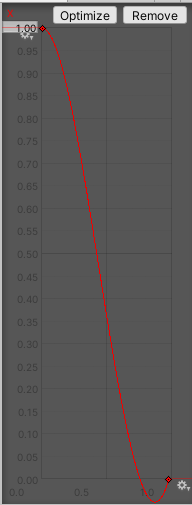

# Elemental Tower Defence

A tower-defence game you can also play as a first-person shooter.

Build turrets along the path like any tower defence — then drop into first person
as the wizard and fight the wave yourself. Enemies drop *elemental stones* you have
to physically run over to collect, which means every kill is a decision: hold your
position, or break formation to go pick up the money you just earned.

Built in Unity 2019.4 for COMP30019 (Graphics and Interaction) at the University of
Melbourne.

**▶ [Watch the gameplay video](https://www.youtube.com/watch?v=GP1lHn26D1w)**

---

## Contents

- [The idea](#the-idea)
- [Playing it](#playing-it)
- [Running it](#running-it)
- [How it works](#how-it-works)
  - [Two cameras, one player](#two-cameras-one-player)
  - [Custom shaders](#custom-shaders)
  - [Particle systems](#particle-systems)
  - [Code layout](#code-layout)
- [Designing it with players](#designing-it-with-players)
- [Known issues](#known-issues)
- [Credits](#credits)
- [Third-party assets and references](#third-party-assets-and-references)

---

## The idea

Most tower defence games make you a spectator. You place your towers, you press
start, and then you watch. The one thing this game changes is that you are *in* the
level — a wizard who walks the map, aims, and shoots alongside the turrets you built.

That single change pulls on everything else:

- **Money is physical.** Killing an enemy drops an elemental stone on the ground.
  It is not credited to you until you walk over it. Camping in a corner is safe and
  poor; wading into the path is lucrative and dangerous.
- **You have two viewpoints, and they are good at different things.** The bird's-eye
  plan view is where you think. First person is where you fight. Switching between
  them is a tactical act, not a settings toggle.
- **You upgrade too, not just your towers.** The same currency buys turret upgrades
  *or* your own damage and fire rate, so every stone is a bet on which of you should
  be doing the killing.

Clear all 20 waves to win. Lose all 20 lives and you retry with a different plan.

## Playing it

| Key | Action |
|---|---|
| `W` `A` `S` `D` | Move |
| `Space` | Jump (press twice to double-jump) |
| `C` | Switch between plan view and first person |
| `Mouse` | Aim (first person — cursor locks to the crosshair) |
| `Left click` | Magic attack |
| `B` | Open the shop / upgrade panel |
| `1` `2` `3` | Buy basic turret 1, 2, or 3 |
| `Q` | Upgrade your attack damage |
| `E` | Upgrade your fire rate |

**In plan view**, `WASD` moves the wizard along X and Z, and clicking the ground
attacks the monster nearest to where you clicked. Good for reading the board and
placing turrets.

**In first person**, movement is relative to where you are facing and the mouse
controls yaw and pitch, like any FPS. Good for actually hitting things.

**Building a turret:** open the shop, pick one of the three basic turrets, then hover
a node on the map. Green means you can build there; red means the node is occupied or
you cannot afford it. A preview of the turret appears before you commit.

**Upgrading a turret:** click a built turret to open its upgrade window. The three
basic turrets branch into nine total. The same window sells the turret and frees the
node again.

> Tip: click the turret images when you're in plan view, and use the number keys when
> you're in first person. Reaching for the mouse mid-fight costs you.

## Running it

You need **Unity 2019.4.3f1** specifically — the project targets the built-in render
pipeline of that version and has not been migrated forward.

```bash
git clone https://github.com/kakwak123/elemental-tower-defence.git
```

The repository is around 600 MB because the Unity asset packs are vendored. For a
faster clone that skips the history:

```bash
git clone --depth 1 https://github.com/kakwak123/elemental-tower-defence.git
```

Then open the folder in Unity Hub and load `Assets/Scenes/MainMenu.unity` to start
from the menu, or `Assets/Scenes/Level01.unity` to jump straight into the level.

Audio uses **FMOD 2.00.08**, which is included under `Assets/Plugins/FMOD`.

## How it works

### Two cameras, one player

There are two cameras and exactly one of them is ever active. The plan camera sits
above the map and never moves. The first-person camera is parented to the wizard and
takes mouse input.

`CameraSwitch.SwitchCamera()` flips which is enabled and, critically, changes the
cursor mode with it — locked and hidden in first person so the crosshair *is* the
cursor, free in plan view so you can click nodes:

```csharp
public void SwitchCamera()
{
    if (isOnPlan)
    {
        planCamera.SetActive(false);
        playerCamera.SetActive(true);
        Cursor.lockState = CursorLockMode.Locked;
        isOnPlan = false;
    }
    else
    {
        planCamera.SetActive(true);
        playerCamera.SetActive(false);
        Cursor.lockState = CursorLockMode.None;
        isOnPlan = true;
    }
}
```

`MouseVision` handles look. Pitch is accumulated and clamped to ±60° so you cannot
roll the camera over your own head; yaw rotates the whole body rather than the camera,
so movement direction and view direction stay consistent.

### Custom shaders

Two shaders were written for this project, both in `Assets/CustomShader/`.

**`fog.shader`** — a fog curtain on the planes by the two doors where monsters spawn,
in the spirit of a Dark Souls boss gate. The naive version applies the fog texture
uniformly across the plane, which makes the plane's edges obvious and ruins the
effect. The fix is a mask texture that is opaque at the centre and fades toward the
border, dissolving the silhouette of the geometry.

Doing this as a shader rather than a particle system was a deliberate trade: far
cheaper per frame, and considerably less fiddly to author.

```hlsl
v2f vert(appdata_base v)
{
    v2f o;
    o.vertex = UnityObjectToClipPos(v.vertex);
    o.uv = v.texcoord;
    float3 V = WorldSpaceViewDir(v.vertex);
    V = mul(unity_WorldToObject, V);          // into object space
    o.NdotV.x = saturate(dot(v.normal, normalize(V)));
    return o;
}
```

**`shining.shader`** — a rim-light on the elemental stones. The dot product of the
surface normal and the view direction approaches zero at the silhouette of an object,
so `1 - dot(N, V)` is a ready-made edge mask. That drives colour strength, with
`_rimPower` controlling falloff and `_rimColor` the tint.

This is a gameplay decision dressed as a graphics one: the stones are the game's
currency and you must physically find them on a cluttered map, so they need to read
instantly against the terrain. Making them glow at the edges is what makes that work.

The pipeline itself is deliberately simple — vertex and fragment stages only, no
tessellation.

### Particle systems

Most effects come from free Unity Store packs, but three were built for the game:

- **Advanced bullet turret impact** — an unlit material with a hand-made texture,
  triggered on bullet contact.
- **Campfire** — a cone emitter with size-over-lifetime curving downward, so flames
  appear to be born at the logs rather than in mid-air, plus a rotating flame texture
  in the emission.
- **Burning enemies** — the advanced flame turret applies a damage-over-time effect,
  and the attached particle system is a modified store asset that tracks the enemy as
  it walks.

<p align="center">
  
</p>

### Code layout

All of the project's own code is in `Assets/Scripts/` — about 1,800 lines across 34
files. Everything else under `Assets/` is vendored art, audio, or tooling.

| Area | Files |
|---|---|
| Waves and enemies | `WaveSpawner`, `Wave`, `Enemy`, `EnemyMovement`, `Waypoints` |
| Turrets | `Turret`, `BulletTurret`, `LaserTurret`, `FlameTurret`, `Bullet`, `TurretBlueprint` |
| Building | `Node`, `NodeUI`, `BuildManager`, `Shop` |
| Player | `Playermovement`, `shooting`, `MouseVision`, `UpgradePlayer`, `GemPickUp` |
| Cameras | `CameraSwitch`, `MainCameraController` |
| Game state | `GameManager`, `PlayerStats`, `RoundsSurvived`, `GameOver`, `CompleteLevel` |
| UI and flow | `MainMenu`, `PauseMenu`, `LivesUI`, `MoneyUI`, `UpgradeUI`, `SceneFader`, `TutorialManager` |

Enemies follow a fixed path rather than navigating. `Waypoints` collects the path
blocks into a static array at startup and `EnemyMovement` walks the enemy from one to
the next, requesting the following waypoint once it comes within 0.4 units. Reaching
the end costs the player a life.

## Designing it with players

The game was evaluated with real players rather than by guesswork, using a
questionnaire, structured interviews, cooperative evaluation, think-aloud protocol,
and post-task walkthroughs. Two criticisms came back repeatedly:

**The wave timer was contentious.** Many testers wanted to start each wave themselves
so they could lay out towers deliberately. Others said the timer was the best thing
about it and supplied the pressure. This was a genuine split, not a defect.

**The shooting deserved more.** Almost everyone agreed the first-person element —
the thing that makes the game distinct — was underdeveloped, and that the wizard
should grow visibly stronger as a run progresses.

### What changed as a result

The original design gave every tower and monster an *element*, with elemental
interactions between them and upgrades paid for in matching elemental stones. Testing
killed it. Players consistently found the upgrade system clunky, and either unbalanced
or simply unreadable — largely because the available art could not communicate which
element anything actually was, and because reading that detail from a first-person
angle in a busy fight is hard.

Rather than defend the idea, it was cut. Elemental stones became a straightforward
bonus currency and the upgrade paths were flattened into something legible.

Added in response to feedback: enemy health bars, the turret upgrade UI, sound
effects, more turret variety, the mage power-up, and fixes to UI anchoring in
fullscreen.

Cutting the mechanic the game is named after is the most interesting decision in this
project. The evaluation said it was not working, and the evaluation won.

## Known issues

Carried over honestly from the original submission:

- Audio does not work on macOS.
- Turret upgrades have no keyboard shortcuts; they are mouse-only.
- The laser turret's slow effect does not reliably apply — its per-frame slow is
  cancelled by an unconditional speed reset in `Enemy.Update()`.
- A burning enemy killed by something other than the burn tick leaks its flame
  particle effect into the scene.

## Credits

Originally built as a group project for COMP30019 at the University of Melbourne.

| Contributor | Work |
|---|---|
| **John Minseok Kim** | Monster spawning and wave logic, camera switching, input, monster prefabs and drops, upgrade / player-status / game-status UI, background music and sound effects, pause and start menus, aiming, game balance |
| **Jiawei Xu** | Turret UI, prefabs and code, shop, in-game tutorial, fog shader, enemy on-fire particle system, bullet explosion particles |
| **Yanshuo Wang** | Flame effects, cameras, FPS and top-down shooting, shaders, player movement and shooting consistency across both views |
| **Zi Chen Li** | Map design, assets and prefabs, game pitch, player feedback sessions and interviews, monster wave logic, camera tuning for both views, movement tuning, game balance, sound effects |

This repository is a personal archive maintained by
[@kakwak123](https://github.com/kakwak123). The work is the group's.

## Third-party assets and references

Most 3D models, textures, and many particle effects are free assets from the Unity
Asset Store, vendored under `Assets/`. Simple geometry was built from Unity primitives
using ProBuilder and ProGrids.

- **FMOD** — audio engine and scripts
- **LeanTween** — UI and transition tweening
- **TextMesh Pro** — text rendering

Learning references used during development:

- [Tower defence series](https://www.youtube.com/watch?v=beuoNuK2tbk&list=PLPV2KyIb3jR4u5jX8za5iU1cqnQPmbzG0) — Brackeys
- [Fog shader](https://www.youtube.com/watch?v=0GVv5Qh48FU)
- [Surface shader](https://www.youtube.com/watch?v=xpBCK9U4G84&t=126s)
- [FPS controller](https://www.youtube.com/watch?v=_QajrabyTJc)
