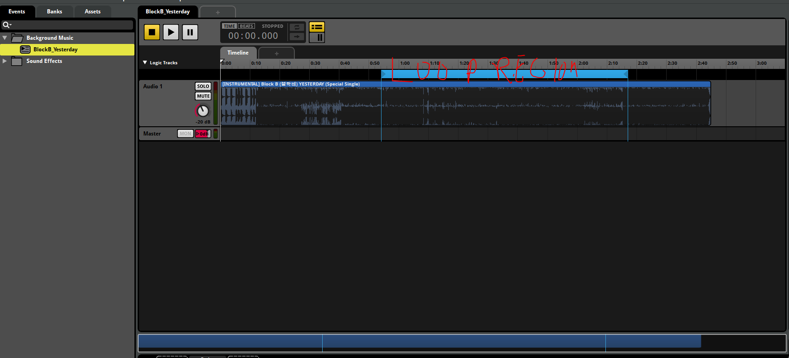

**The University of Melbourne**
# COMP30019 – Graphics and Interaction

Final Electronic Submission (project): **4pm, Fri. 6 November**

Do not forget **One member** of your group must submit a text file to the LMS (Canvas) by the due date which includes the commit ID of your final submission.

You can add a link to your Gameplay Video here but you must have already submit it by **4pm, Sun. 25 October**

## Gameplay Youtube Link
https://www.youtube.com/watch?v=GP1lHn26D1w


# Project-2 README

You must modify this `README.md` that describes your application, specifically what it does, how to use it, and how you evaluated and improved it.

Remember that _"this document"_ should be `well written` and formatted **appropriately**. This is just an example of different formating tools available for you. For help with the format you can find a guide [here](https://docs.github.com/en/github/writing-on-github).


**Get ready to complete all the tasks:**

- [x] Read the handout for Project-2 carefully

- [x] Brief explanation of the game

- [x] How to use it (especially the user interface aspects)

- [x] How you modelled objects and entities

- [x] How you handled the graphics pipeline and camera motion

- [x] Descriptions of how the shaders work

- [x] Description of the querying and observational methods used, including: description of the participants (how many, demographics), description of the methodology (which techniques did you use, what did you have participants do, how did you record the data), and feedback gathered.

- [x] Document the changes made to your game based on the information collected during the evaluation.

- [x] A statement about any code/APIs you have sourced/used from the internet that is not your own.

- [x] A description of the contributions made by each member of the group.

## Table of contents
- [COMP30019 – Graphics and Interaction](#comp30019---graphics-and-interaction)
- [Project-2 README](#project-2-readme)
  * [Table of contents](#table-of-contents)
  * [Team Members](#team-members)
  * [Technologies](#technologies)
  * [Quick clone (faster)](#quick-clone-faster)
  * [Explanation of the game](#explanation-of-the-game)
  * [How to use it(especially the UI aspects)?](#how-to-use-it-especially-the-ui-aspects--)
      - [Basic Game Conrols](#basic-game-conrols)
      - [Instruction on player control in different views](#instruction-on-player-control-in-different-views)
      - [Instruction on turret](#instruction-on-turret)
      - [Instruction on player ability](#instruction-on-player-ability)
      - [Objective](#objective)
  * [Model objects and entities](#model-objects-and-entities)
      - [Main Character](#main-character)
      - [Enemy](#enemy)
      - [Turret](#turret)
      - [Map](#map)
  * [Graphics pipeline and shaders](#graphics-pipeline-and-shaders)
  * [Particle system](#particle-system)
  * [Camera Motion](#camera-motion)
  * [Querying techniques used](#querying-techniques-used)
      - [Questionnaire](#questionnaire)
      - [Interview:](#interview-)
  * [Observational techniques used](#observational-techniques-used)
      - [Cooperative evaluation:](#cooperative-evaluation-)
      - [Think Aloud:](#think-aloud-)
      - [Post-task walkthroughs:](#post-task-walkthroughs-)
  * [Improvements according to feedbacks](#improvements-according-to-feedbacks)
  * [Unsolved problems:](#unsolved-problems-)
  * [External API](#external-api)
  * [References](#references)
  * [Individual contributions](#individual-contributions)


## Team Members

| Name | Task | State |
| :---         |     :---:      |          ---: |
| John Minseok Kim  | Scene/Script/Prefab     |  Done |
| Jiawei Xu    | Scene/Script/Shader/Particle System     |  Done |
| Yanshuo Wang    | Scene/Script/Shader      |  Done |
| Zi Chen Li   | Scene/Script/Feedback      |  Done |

## Technologies
Project is created with:
* Unity 2019.4.3f1
* FMOD 2.00.08

## Quick clone (faster)
Use a shallow clone to download only the latest snapshot:

```bash
git clone --depth 1 https://github.com/Graphics-and-Interaction-COMP30019/project-2-project2_group_29.git
```

If you only need specific folders (for example documentation), use sparse checkout:

```bash
git clone --depth 1 --filter=blob:none --sparse https://github.com/Graphics-and-Interaction-COMP30019/project-2-project2_group_29.git
cd project-2-project2_group_29
git sparse-checkout set README.md ProjectSettings Packages
```

## Explanation of the game
Elemental tower defence as the name suggested is a tower defence type game, we followed a traditional formula for tower defence games having waves of enemies and various towers that can be built to defend it. On top of it we also implemented various other features for a more interesting playthrough.

On the surface, the game is set with our player as a wizard, the wizard is able to attack and walk around the map, players may also toggle between views to plan ahead strategically. Of course being a tower defence game at its core, players also need to build towers to defend against the monsters.

The monsters will travel along the path object that is specified under the hierarchy table. In the very front of the path we have placed a ‘START’ object that sets the position where the monster spawn and the ‘END’ object that destroys monsters that pass through the end. In our wavepoint script, we have allocated each path block into an array and in our enemy script the monster continuously chases to the next path until it reaches the END.

```c#
   // Attribute as static so its unique and accessable from other scripts
   public static Transform[] points;
```

We have a total of 9 types of turrets. The 3 basic turrets buyable from the shop and other turrets can be upgraded from these 3 turrets. Turrets will target the closest enemy to themselves and deal damage to the enemy, additionally with different attributes of the turrets. Some turrets could slow enemies down, some turrets could tick a fire to enemies and deal constant damage, etc.

Clear all the 20 waves of enemies to win the game. If you lost all of your lives, you could retry the game with different turret selections and try to conquer it. If you survived the 20 waves, congratulations and hope you enjoy the game.

There is a status indicator which shows the state of the game at a given time. The status can show either wave countdown or wave number depending on which situation the game is in. If the wave is started, then it will display the current wave number and if it is not starting, then it will do a countdown to the start of the wave.
```c#
//Under Wavespawner script
		if (countdown <= 0f)
		{
			statusText.text = string.Format("Wave {0}", waveIndex + 1)
   ...
			return;
		}
		else
  {
			statusText.text = string.Format("Wave Countdown: {0:00.00}", countdown);
		}
```


There is also a player status indicator which shows the player's remaining life and gem. Their values are set as a public static variable so that other scripts can manipulate the data such as monster crossing the end will damage the life and picking up the gem will give gems depending on its type.
``` c#
//Under Playerstats script
	void Update()
   	 {
		life.text = "" + Lives;
		gem.text = "" + Money;
	}
```
Sounds are done by using FMOD tool. In the external FMOD program, I have made an area loop and sound effects to make the gameplay even better. The sounds are played by the script StudioEventEmitter, an external script that lets you play the sound with a condition.

<p align="center">
  
</p>

## How to use it(especially the UI aspects)?
#### Basic Game Conrols
Player controls will be WASD to move and the game key changes depending on what the game view is. In addition, you can shift the POV by pressing the key C. For example, when you are on the first-person view, pressing C will shift to the fixed plan view. Besides, the player can also jump by pressing space in two views, and moreover double jump is also enabled by pressing space twice.

#### Instruction on player control in different views
- On the fixed plan view, you can control the player’s X and Z positions, and by clicking the ground it will attack the closest monster to the ground you have clicked.

- On the first-person view, WASD will move the player’s position with respect to the player facing direction. Mouse will be locked to the game and it will turn invisible. There is an aiming dot placed in the center to indicate where your cursor is located. Left-click will do a magic attack that damages monsters. There is another element that affects the player’s movement in the first-person view, and that is the mouse control. As to how most fps games are controlled, you will be able to control the yaw of the camera that is attached to the player. Controls will change the movement depending on where the camera is facing.

#### Instruction on turret
- To open the shop, you can either press B (stands for buy) or click the shop button. Then the shop UI will show up and you will have access to buying turrets. The specific turret can be bought by pressing the number linked with the image or by clicking the image itself. It is recommended to press the image when you are on the plan view and pressing the number on the first-person view. 

- In order to build a turret, the player can select a turret from the basic three turrets in the shop menu and move the mouse to one node on the map, if the turret can be built (i.e. the player has enough money and the node have no decorations/turrets on it), the node will be highlighted by green and a preview of the turret will appear, otherwise, the node will be highlighted by red and not preview will display.

- To upgrade a turret on the map, simply click on the turret and a window will pop-up and display the turrets that the current turret could upgrade to. With enough money, the player could upgrade the turret to a new one. The player could also click the sell button in the upgrade menu to sell a turret and make the current node empty again.

#### Instruction on player ability
Pressing B will also open up the player’s damage/fire rate upgrade UI. As how pressing 1,2,3 will buy the turret, pressing Q will let the player’s attack damage get stronger and pressing E will make the fire rate even faster. 

#### Objective
As to how most tower defence games are played, the objective of this elemental tower defence is to defend the player’s territory by obstructing and killing the enemy attackers who always come along the pathway in the map. You can place turrets and other defensive structures to kill the monsters on the pathway. The key difference to this game is that the player can move in a first-person view, and you can attack the enemies coming like a fps game. Killing monsters will drop money called “elemental stone” and that elemental stone is the currency of the game. You will need to physically pick up by colliding the stone. And with those stones, you will be able to buy/upgrade turrets or upgrade the player’s attack damage/rate. 


## Model objects and entities
Most objects in the game are free assets from the Unity store. Some simple objects and geometries are made from unity basic models (planes, boxes, etc). Below is how we model each important game object in our game.
#### Main Character
- **HP** determines how many monsters can escape.
- **Money(Gemstone count)** is used to buy and upgrade turrets or upgrade player ability.
- **FireDamage** is the single attack damage.
- **FireRate** is the fire frequency.

#### Enemy
- **HP** determines how much damage it can take.
- **MovingSpeed** determines how fast it can go along the path.

#### Turret
- **Effect** is the unique ability of each special turret.
- **Damage** is the damage it does to the monsters.
- **Cost** is mainly related to selling price, construction price and upgrade price.

#### Map
- **Map** cube is the fundamental building unit in the construction.
- **Path** specifies which way and direction the enemy will approach on the map.
- **Decoration** means some extra decorating elements on the map. (Trees, Ruins, Fence, Grass)

## Graphics pipeline and shaders
- Our rendering pipeline is simplified. We manipulate vertices position in the vertex shader and there is no extra Tesselation Stage to generate additional vertices. Our two customized shaders are mainly about operations in the fragment shader and vertex shader. In the Fragment stage, we aim to change the color in the shining shader. And in the Output-Merger Stage, we combine everything together to generate the final image.

- One custom fog shader is implemented on planes near the two doors on the map. A fog texture is applied to the material and then to the planes to simulate a fog event. One problem at this stage is that the texture is applied uniformly across the plane, which makes the edges of the plane distinct. To solve this problem, we placed a Mask texture in the material, with concrete pixels at the center and fading pixels near the edge of the texture, to remove the sharpness of the overall material near the edges of the plane and make the fog material look more realistic. Another approach to achieve this fog effect is to use the particle system, but it means more computational cost and it would be much difficult to implement. With shaders, we could achieve a similar graphics effect with simplicity and convenience. This shader effect is similar to the fog effect in Dark Soul boss fight, and it also adds some sorts of mysterious elements to the generation of monster waves. 
```Cg                
                v2f vert(appdata_base v)
                {
                    v2f o;
                    o.vertex = UnityObjectToClipPos(v.vertex);
                    o.uv = v.texcoord;
                    float3 V = WorldSpaceViewDir(v.vertex);
                    V = mul(unity_WorldToObject,V);// transofm into same coordinate
                    o.NdotV.x = saturate(dot(v.normal,normalize(V)));//dot product
                    return o;
                }
``` 
- Another important shader used is the shining shader for crystals. _rimPower is used to control the strength of edge color and _rimColor decides which color to be applied at the edge. First, vectors are transformed into the same coordinate system. What’s more , the dot product between normal line and vision will approach 0 when the position gets closer to the edge. Therefore, we use the value of (1 - dot product result) to set up weights for the color strength to make the crystal shining at the edge of the surface. The reason why we apply this shader to the crystal is that we want to emphasize the value of it, and by making it shining, the crystal would be differentiated from other normal game objects, so that the player can quickly recognize it in the game world.
               
## Particle system
Most of the particle systems (e.g. flame thrower, explosions) used are free assets from the unity store. The particle system of the hit effect of Advanced Bullet Turret is a customized one. Standard unlit material with a customized texture is applied to the particles to simulate a realistic explosion when the bullet hit an enemy. 

What’s more, the campfire is also a customized one.The shape of the campfire is cone, and the curve of size over lifetime is set to be decreasing from the beginning, which makes it look like that it is generated from the bottom wood. We also attach a fire image to the particle system and make it rotate in the emission so as to simulate the real flame effect. 
<p align="center">
  
</p>
Furthermore, when the advanced flame turret hits an enemy, it will tick a on fire effect to the enemy, which damages the enemy at a constant rate. This particle system is modified from the free asset to satisfy our desired requirement.

## Camera Motion
We have two different cameras that display the game. One is a main camera that is placed on top of the map to display the whole map in a bird eye view. This camera is a fixed one and it will not move. Another one is the camera that is attached to the player and the camera can move around depending on the yaw input of the mouse. 

Mousevision will be processing the mouse movement and control facing direction of player in FP view
```c#
void Update()
    {
        // get the mouse input
        float mouseX = Input.GetAxis("Mouse X") * mouseSensitivity * Time.deltaTime;
        float mouseY = Input.GetAxis("Mouse Y") * mouseSensitivity * Time.deltaTime;

        // it will rotate the camera on y position (wrong variable name) and set a limit to y rotation like our head
        xRotation -= mouseY;
        xRotation = Mathf.Clamp(xRotation, -60f, 60f);

        //move the camera rotation up and down by the mouse input
        transform.localRotation = Quaternion.Euler(xRotation, 0f, 0f);
        //rotate the whole body by the mouse input we received.
        playerBody.Rotate(Vector3.up * mouseX);
    }

```

CameraSwitch is processed when a player press ‘C’
```c#
    public void SwitchCamera()
    {
        if (isOnPlan)
        {
            planCamera.SetActive(false);
            playerCamera.SetActive(true);
            Cursor.lockState = CursorLockMode.Locked;
            isOnPlan = false;
        }
        else
        {
            planCamera.SetActive(true);
            playerCamera.SetActive(false);
            Cursor.lockState = CursorLockMode.None;
            isOnPlan = true;
        }
    }


```
The code will run as a flag, if the current mode is a plan view(bird eye view), then if a player presses c, then the active camera will turn off and inactive camera will turn on and switch the game view. And set the opposite boolean value for the next switch. In FP view, the game will lock the cursor so that the center dot becomes the cursor. 

## Querying techniques used
####  Questionnaire

The advantage of a questionnaire is that it can collect large quantities of data, but since questionnaires are quite inflexible, as well as games reviews being very subjective, it was very difficult to create suitable multiple choice options. To make up for it’s disadvantages I decided to use the data collected from the questionnaire hand in hand with the interview questions i will be asking, which will be another technique covered right after.

The questionnaire was conducted via an online link, it consisted of 7 questions, most of which is divided between a yes/no response for simplicity sake, as this questionnaire will serve more as a ‘filter’ for which questions I will be asking in the interview for reasons stated above. 

Some of the questions will have more responses than others as some of the questions were added in later on.

**Question 1: Do you think the tutorial was helpful**
<p align="center">
  
</p>

**Question 2: Do you think music felt fitting for the game**
<p align="center">
  
</p>

**Question 3: Does the wizard feel good to control**
<p align="center">
  
</p>

**Question 4: Did the GUI feel easy to use**
<p align="center">
  
</p>

**Question 5: Did the game have a good difficulty balance (Not too easy not too hard)**
<p align="center">
  
</p>

**Question 6: Does shooting feel good**
<p align="center">
  
</p>

**Question 7: Was the game fun overall**
<p align="center">
  
</p>

As seen by the results although there are several areas we needed to work on, the most severe problem was player control, difficulty balance and GUI use, I was able to construct by interview questions more tailored to our current problems using this data collected.

#### Interview:

Interviewing was done only for 8 different testers, as usually interviewing required quite a long time and it often felt quite redundant as some of these questions have already been asked using other techniques, however in order to explore the problems in more detail it was still carried out, the following will be a super generalised response for your reading convenience. 

The questions will be mainly based around the player control, difficulty balance and GUI use, starting with the quickest one to fix was the GUI.

I asked players how they felt about the GUI, and most responded as it being too clunky and took up too much of the screen, they said the upgrade menu in particular should not take up the whole screen so this was taken into account in future developments. When asked how they would like to see it being changed, the general consensus was to make certain menus such as the shop, the upgrade menu, money/life bar smaller and the pause menu buttons less transparent and the texts easier to read.

Next was the balancing issue, when asked about this, all 8 interviewed believed the game was way too easy, they found that they didn’t even need to build towers to beat the game because of how weak the monsters were. There was 2 main solutions they provided when asked, they wanted to either make monsters much stronger or to get rid of the ability for the player to shoot, however because more than half of the testers actually enjoyed the shooting element in the game, wwe decided to only buff the monsters and not get rid of the ability for player to shoot. Furthermore, players complained about the speed of certain monsters being way too fast compared to others, and that some monsters that were supposed to be weak actually ended up killing the players the most, and vice versa (strong monsters not being challenging), so speed was also a major issue. Lastly the tower defence stones in the early stages during the testing phase was not balanced at all, players felt it was way too overpowered and by simply having a single maxed out elemental tower was enough to beat the whole game.

For the player control, this was the most difficult to fix since it’s difficult to summarise all the responses given by testers. Generally tho, players reported that the wizard felt way too floaty, and had no weight, when traversing between different Y values, they felt like they were floating for way too long, furthermore, players did not like having the option to sprint as the map was too small for the option to be of any use. They complained that they would sometimes accidentally fall off the map because of how fast the player accelerated. Furthermore, 3 of the 8 players complained about bumping into certain decorations of the map. There was several other issues but these were the main ones we were able to extrapolate from the interviews.

## Observational techniques used
Observational techniques have been used for around 17 different testers, all of which are around 20 years old and play video games often, the total interview time without the waiting was around 10 hours.
#### Cooperative evaluation:
By being in the same discord call together, I was able to answer any questions the tester might have had on the game, at the same time I was able to ask them how they feel about certain features that we have implemented that falls outside of a traditional tower defence gameplay. The benefits of this type of evaluation is that it encourages testers to give constructive criticisms, however as the criticism is given in a conversation, it might not be explained to enough detail and can be difficult to pick up sometimes, and of course it is very subjective.

One example of a change we made to the game through feedback was this:

In an earlier version of our game, when I asked the testers how they felt with the bird eye view camera, the feedback was not so positive, the testers said it felt hard to control, and one of the testers even complained about motion sickness, one of the testers offered a solution saying maybe allowing the player to change the camera angle would be a solution to this. However, after talking with several other testers, the best solution we came up with was to lock the camera completely at a nearly 90 degree angle.

So through the communication and back and forth questioning between the testers, I was able to change the way our birds eye camera worked. Changing the camera from a hard to control, free view camera, to a birds eye view locked camera.
#### Think Aloud:
Think aloud is very similar to cooperative evaluation, where as a cooperative evaluation is the result of back and forth questioning, think aloud lets us ask more specific questions to the testers and takes notes on how they feel. But although it is more specific and therefore makes it easier for testers to provide feedback, it still suffers the disadvantage of being subjective and selective.

Think Aloud was used when the tester was asked to stream their gameplay on discord live to me, I would ask how they feel about certain features of the game after I observe them doing it.

Observation: When tester was using the elemental stones to upgrade towers
Response: Very clear confusion on the uses of the elemental stone, tester says it felt unneeded and makes the game too complicated for no real benefits. Although some testers responded positively to this, the compliments were mainly on the creativeness and uniqueness of upgrading towers with drops from the monsters, it was not necessarily because they liked it as part of the gameplay.

Observation: When tester was shooting monsters manually
Reponse: Most testers responded positively to this feature, some enjoyed the shooting element as typical tower defence games does not involve much user interaction after the wave starts, others enjoyed the strategic advantage of being able to save up for more expensive towers by dishing out extra damage themselves. However, we did receive one response where the tester felt a tower defence game with a shooting mechanic felt unfitting and an annoying feature to have.

#### Post-task walkthroughs: 
Post task walkthroughs will mainly focus on the criticisms rather than the compliments, due to the fact that most of the testers chosen for this type of feedback were close friends who most likely values our efforts and will be more lenient when giving feedback compared to some of the other testers we have chosen. The advantage of this type of feedback is we get a more general response to the game hence giving us a direction to work towards. However this could also mean we risk having missed too many small details, as they could be forgotten or overwritten by other things. The ‘task’ selected was just completing the first level.

Overall, the feedback was quite positive, however there were 2 repeated criticisms that we received.
Testers did not like the wave system being on a timer, they preferred to have more time to organise their tower layouts and decide themselves when to start the next wave, however, this was a split opinion as some others when asked about their feeling about this, enjoyed the intensity it brought to the game.
Secondly, players wanted more to the shooting aspect of the game, they wanted the wizard to grow stronger as the game progresses and perhaps gain cooler abilities, almost all testers agreed that the shooting element could have improved by a lot, and it has wasted potential.

## Improvements according to feedbacks
Originally, our plan was to implement elemental attributes to each tower and monster, having elemental special effects and special interactions between them and also having towers upgradeable using the elemental stones dropped by monsters, which was the core difference we wanted to make for our game. During the playtests, we received repeated complaints about the upgrading feature too clunky and either unbalanced or confusing. We believe it is because of the fact that we cannot clearly show which elements the towers and monsters are since we lack the assets, it could also be due to the chaotic nature of the player’s view since the game is often played in a POV angle. Because of this we instead just made elemental stones give extra gold to the player, and simplified the overall upgrade paths for towers.

Besides what we got in the feedback, we decided to implement additional features. They are the health bar of enemies, turret upgrade UI, sound effect, variation of turrets and the mage power-up. Additionally, there are also some adjustments on UI position in full-screen mode to make them appear in the correct position according to feedback. Furthermore, clear UI design and extra buttons are added for the convenience of the player.

## Unsolved problems:
Sound does not work on Mac platform.

Havent added hotkeys for the upgrade tower


## External API
FMOD scripts and program for music.

Built-in unity tool probuilder and progrid to allocate blocks into a correct position 

## References
Tower defence game guide: https://www.youtube.com/watch?v=beuoNuK2tbk&list=PLPV2KyIb3jR4u5jX8za5iU1cqnQPmbzG0  
Fog shader: https://www.youtube.com/watch?v=0GVv5Qh48FU  
Surface shader :https://www.youtube.com/watch?v=xpBCK9U4G84&t=126s  
FPS controller: https://www.youtube.com/watch?v=_QajrabyTJc  


## Individual contributions

- Zichen Li - Map design, asset and prefab design, game pitch, conducted player feedbacks, hosted player interviews, basic monster wave logic together with john, player camera adjustment pov, player camera adjustment birds eye view, general balancing of game, player movement adjustment, sound effects.

- Jiawei Xu - UI, prefabs and code of turret, shop, in-game tutorial. Fog shader, enemy on fire particle system, bullet of advanced bullet turret explosion particle system.

- Yanshuo Wang - flame, camera, FPS shooting, top-down shooting, shader, player movement in top-down view, consistency of player movement in different views, consistency of player shooting in different views.

- John Kim - Monster Spawn with Jason, Wavelogic with Jason, Camera Switch with Jason, Keys, Monster prefab, monster drop item, Upgrade UI, Playerstatus UI, Gamestatus UI, Other UI fixes, Background Music, Sound effects with jason, Pause menu, Start Menu, Aim, Balancing game.
